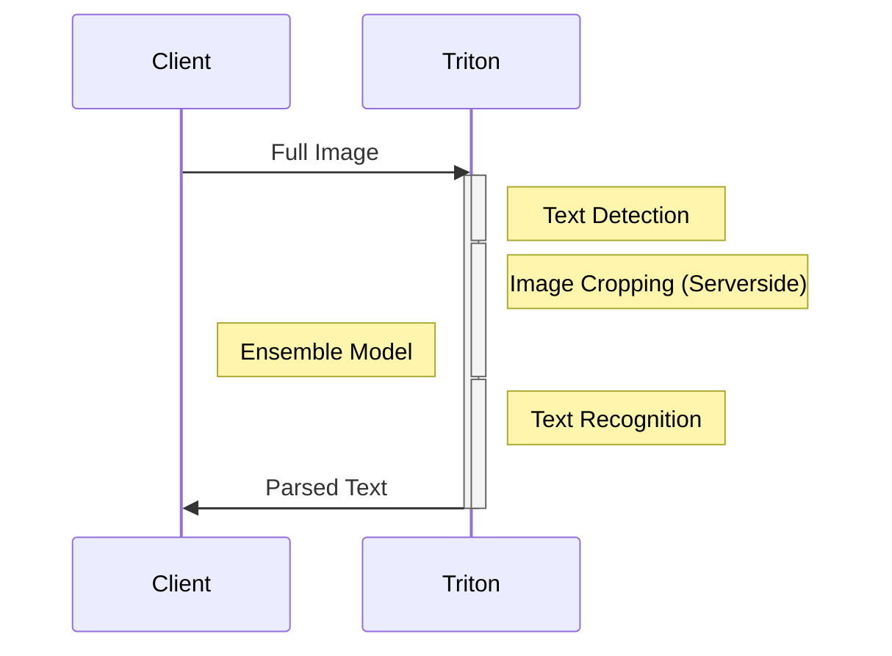
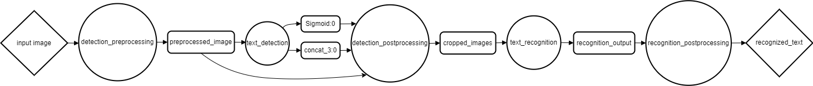
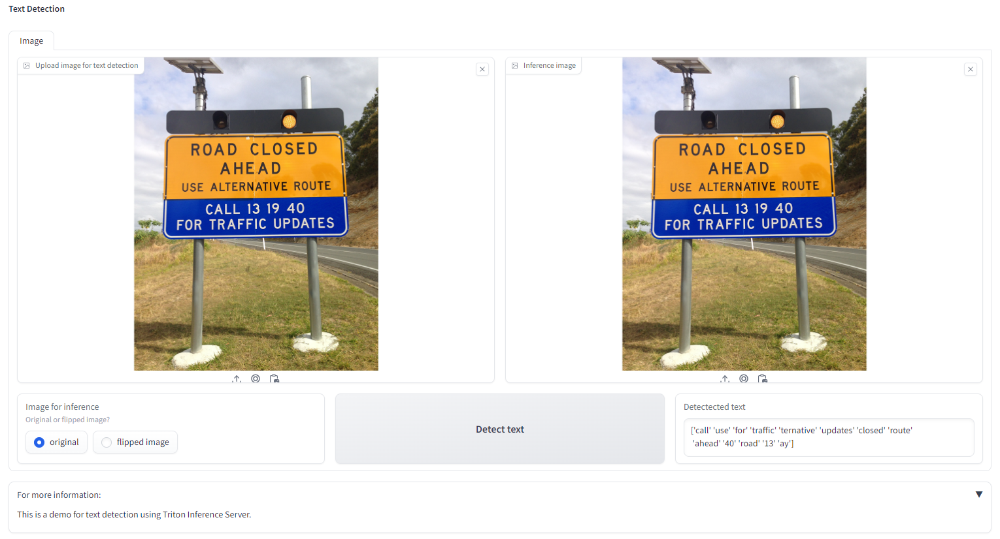
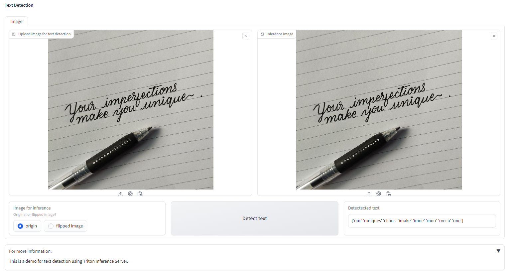

## Deploying Text Detection Model with Triton Inference Server

This project is to demonstrate how to use NVIDIA Triton Inference Server to deploy a **text detection** and **recognition model** ensemble. The text detection model is based on [OpenCV Text Detection (EAST text detector)](https://pyimagesearch.com/2018/08/20/opencv-text-detection-east-text-detector/) and the text recognition model is based on [Deep Text Recognition](https://github.com/clovaai/deep-text-recognition-benchmark/blob/master/README.md)

## Environments

- OS Ubuntu 20.04 (WSL2)
- Python 3.8.10
- Triton Inference Server 2.34.0
- NVIDIA GPU Computing Toolkitwith CUDA 11.0
- OpenCV 4.8.1
- Pillow 9.3.0
- ONNX 1.15.0
- ONNX Runtime 1.16.0
- Docker 24.0.6


## Triton Model Ensembles

To reduce the number of network calls, we can combine the text detection and text recognition models as well as the image pre/postprocessing into a single ensemble model. The ensemble model will take the full image as input and return the parsed text as output. The ensemble model will execute multiple models in a single network call.


**Network Call**



**Directed Acyclic Graph**

Below is a graphical representation of our model pipeline. The diamonds represent the final input and output of the ensemble, which is all the client will interact with. The circles are the different deployed models, and the rectangles are the tensors that get passed between models.



The configuration of model ensembles is defined in `/ensemble_model/config.pbtxt`.

<details>
<summary>Expand for ensemble config file</summary>

```
name: "ensemble_model"
platform: "ensemble"
max_batch_size: 0
input [
  {
    name: "input_image"
    data_type: TYPE_UINT8
    dims: [ -1, -1 ]
  }
]
output [
  {
    name: "recognized_text"
    data_type: TYPE_STRING
    dims: [ -1, -1 ]
  }
]

ensemble_scheduling {
  step [
    {
      model_name: "detection_preprocessing"
      model_version: -1
      input_map {
        key: "detection_preprocessing_input"
        value: "input_image"
      }
      output_map {
        key: "detection_preprocessing_output"
        value: "preprocessed_image"
      }
    },
    {
      model_name: "text_detection"
      model_version: -1
      input_map {
        key: "input_images:0"
        value: "preprocessed_image"
      }
      output_map {
        key: "feature_fusion/Conv_7/Sigmoid:0"
        value: "Sigmoid:0"
      },
      output_map {
        key: "feature_fusion/concat_3:0"
        value: "concat_3:0"
      }
    },
    {
      model_name: "detection_postprocessing"
      model_version: -1
      input_map {
        key: "detection_postprocessing_input_1"
        value: "Sigmoid:0"
      }
      input_map {
        key: "detection_postprocessing_input_2"
        value: "concat_3:0"
      }
      input_map {
        key: "detection_postprocessing_input_3"
        value: "preprocessed_image"
      }
      output_map {
        key: "detection_postprocessing_output"
        value: "cropped_images"
      }
    },
    {
      model_name: "text_recognition"
      model_version: -1
      input_map {
        key: "input.1"
        value: "cropped_images"
      }
      output_map {
        key: "307"
        value: "recognition_output"
      }
    },
    {
      model_name: "recognition_postprocessing"
      model_version: -1
      input_map {
        key: "recognition_postprocessing_input"
        value: "recognition_output"
      }
      output_map {
        key: "recognition_postprocessing_output"
        value: "recognized_text"
      }
    }
  ]
}
```

</details>

## Deployment
### 1. Deploy the Text Detection and Text Recognition Models

There are 3 different python backend models that will be served with Triton:
>1. `detection_preprocessing`
>2. `detection_postprocessing`
>3. `recognition_postprocessing`

To deploy Text Detection and Text Recognition models, we need to convert the models to ONNX format and then create a folder for each model in the `model_repository` folder.

**Deploy the Text Detection Model**

- Launch NGC TensorFlow container environment with **docker** (Recommended)

`docker run -it --gpus all -v ${PWD}:/workspace nvcr.io/nvidia/tensorflow:22.01-tf2-py3`

then execute:

`bash utils/export_text_detection.sh`

**Deploy the Text Recognition Model**

- On another terminal, launch NGC TensorFlow container environment with **docker** (Recommended)

`docker run -it --gpus all -v ${PWD}:/workspace nvcr.io/nvidia/pytorch:22.01-py3`

then execute:

`bash utils/export_text_recognition.sh`


### 2. Deploy server-side & client-side locally

**To run locally, in the `/app.env` file, make sure to set `IS_GCLOUD_DEP = False`.**

There are 2 methods to deploy the server-side.

#### 2.1. Deploy server-side and client-side separately

**In the `/app/.env` file, set `IS_DOCKER_COMPOSE_USE = False`.**

- Build server docker images:

```
docker build ./ -f Dockerfile -t asia.gcr.io/mles-class-01/text-detection-triton:latest
```

- Launching the triton server:

```
docker run --name text-detection-triton --gpus=all -it --shm-size=1g --rm \
  -p8000:8000 -p8001:8001 -p8002:8002 \
  -v ${PWD}/model_repository:/models \
  asia.gcr.io/mles-class-01/text-detection-triton:latest \
  tritonserver --model-repository=/models
```

Note: Using port 8000 for HTTP, 8001 for GRPC, and 8002 for metrics.

- On other terminal, run the application:

```
python ./app/app.py
```

**Open `http://localhost:7860/` for inference GUI.**

**Note:** You can use `Flipped image` option in case of using webcam to capture image.


#### 2.2. Deploy server-side using docker compose

**In the `/app/.env` file, set `IS_DOCKER_COMPOSE_USE = True`.**

- Build docker compose:

```
docker-compose build
```

- Run docker compose:

```
docker-compose up
```

**Open `http://localhost:7860/` for inference GUI.**

**Note:** You can use `Flipped image` option in case of using webcam to capture image.

- Stop and remove the docker-compose service:

```
docker-compose down
```

## Visualizations

Model work well with printed text




but not very good with hand-written text




## Tips

1. An easy way to see the structure with a graphical interface is by using tools like [netron](https://netron.app/).


## Troubleshooting

**1. Error when converting ***text_detection*** model to ONNX format**
>`python -m tf2onnx.convert --input frozen_east_text_detection.pb --inputs "input_images:0" --outputs "feature_fusion/Conv_7/Sigmoid:0","feature_fusion/concat_3:0" --output detection.onnx`
>`ValueError: Could not infer attribute explicit_paddings type from empty iterator`

**Solution:**
Installing tf2onnx via pip will install onnx:1.15.0. You can verify that by running pip list | grep onnx
In order to downgrade the version of your onnx dependency, just run `pip install onnx==1.14.1`. ([REF](https://github.com/onnx/tensorflow-onnx/issues/2262))

**2. Error when make inference**

>`UNAVAILABLE - Inference request for unknown model 'ensemble_model'`

**Solution:**
Create version folder for the ensemble model. The version folder can be empty as ensemble doesn't require any model file.

>`tritonclient.utils.InferenceServerException: [400] in ensemble 'ensemble_model', Failed to process the request(s) for model instance 'detection_preprocessing_0', message: Failed to increase the shared memory pool size for key 'triton_python_backend_shm_region_6' to 67108864 bytes.`

**Solution:**
Increase `--shm-size` value when launching triton server, e.g: `--shm-size=1g`


## For more information
| [Triton Model Deployment](https://github.com/triton-inference-server/tutorials/blob/main/Conceptual_Guide/Part_1-model_deployment/README.md) | [Triton Model Ensembles](https://github.com/triton-inference-server/tutorials/blob/main/Conceptual_Guide/Part_5-Model_Ensembles/README.md) |
| :--- | :--- |


## Logs

- 2023/12/05: Modify docker compose | Add .env variables
- 2023/11/28: Add docker compose file | Modify scripts | Deploy model to Google Cloud
- 2023/11/22: Package the project into a docker container
- 2023/11/21: Replace torchvision with Pillow for image preprocessing
- 2023/11/20: Initial commit